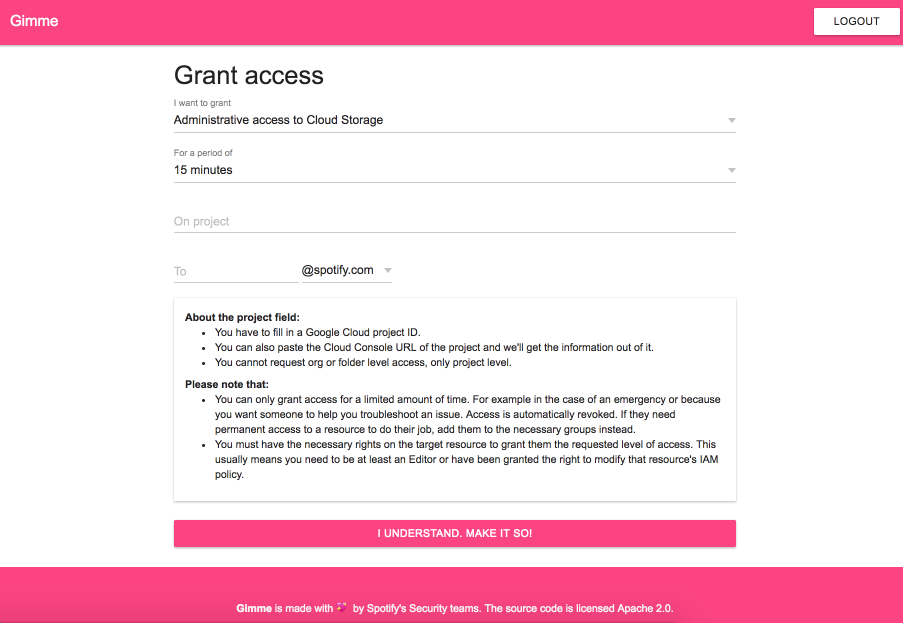

# 👮‍♀️ Gimme 👮‍♂️



***

## Table of Contents

- [👮‍♀️ Gimme 👮‍♂️](#️-gimme-️)
  - [Table of Contents](#table-of-contents)
  - [ℹ️ About](#ℹ️-about)
  - [⚕️ Current state](#️-current-state)
  - [⚡ Installation](#-installation)
  - [🔧 Configuration](#-configuration)
  - [🚀 Deploying](#-deploying)
    - [App Engine Standard](#app-engine-standard)
    - [Container](#container)
  - [🚧 Development](#-development)
  - [💉 Testing](#-testing)
  - [🤸 Contributing](#-contributing)
  - [📝 License](#-license)

## ℹ️ About

Gimme's purpose is to allow you to move your organisation to a point where
people only have the basic permissions they need to do their job. Using
Gimme anyone can then grant others additional access to resources, for
example during an incident or to help troubleshoot or debug an issue. Gimme
leverages time bound IAM Conditions to ensure people only gain truly
temporary extra privileges.

**NOTE**: In order to be able to use Gimme you'll need to have access to
the private beta of the IAM Conditions Framework in Google Cloud Platform.
You can [sign up for it over here](https://services.google.com/fb/forms/iamconditionsprivatebetasignup/).

Gimme uses OAuth to authenticate users and obtain an access token, which
it will then use for any action it takes. As such, the person attempting
to grant someone else additional permissions needs to have the necessary
rights on the target resource to do so. This normally means they need
to be an owner or editor of the resource, or have been granted the
capability to modify the IAM policy of the resource.

## ⚕️ Current state

Gimme is in its very early stages. It currently only supports granting
access to users (not groups or service accounts) and only supports a
couple of roles it can grant. Additionally, it only supports time bound
conditions and only on the project level, not for example on an individual
bucket or BQ dataset.

None of these limitations are hard to lift, we just haven't gotten
around to it yet.

## ⚡ Installation

Gimme is a Python 2.7 (b/c App Engine) application. Its dependencies are
managed by [`pipenv`][pipenv]. You can generate a `requirements.txt` with
`pipenv lock -r`.

Though Gimme can be hosted on App Engine it does not rely on the App Engine
SDK for Python. As such you can just `pipenv install` the app locally and
don't have to deal with `gcloud` or the `dev_appeserver.py`.

1. Clone the project
2. `pipenv shell --two` to create/activate a virtualenv (you only need the
   `--two` the first time)
3. `pipenv install` to install the app's dependencies (except for AppEngine stuff)

## 🔧 Configuration

Gimme doesn't have a lot of nobs worth tweaking and those that you can tweak are
available as environment variables. It's generally configured to be as paranoid
as possible when the production settings are loaded, and is a bit more lax when
the development and testing settings are loaded.

* `GIMME_SETTINGS`: path to a `.py` file with contents similar to one of the `Config`
  classes from `settings.py`. This gives you complete control over all settings and
  circumvents any safeguards we might have built-in when it comes to handling those.
  Use with caution.

Other important variables are:

* `GIMME_ALLOWED_GSUITE_DOMAINS=space separtaed list of domains`: Enforces that the
  person trying to use the app is logged in with a Google account matching one of the
  listed domains. If that's not the case, access is denied and all they can do is logout.
  The domain(s) should be the part after the `@` sign in the email address, so
  `example.com` for example, or `'example.com example.org'`
* `GOOGLE_OAUTH_CLIENT_ID=<client id>`
* `GOOGLE_OAUTH_CLIENT_SECRET=<client secret>`

You can get those from the API & Services menu in the Google Cloud Console once
you've set up an OAuth consent screen. You'll need to go to Credentials > Create
Credentials > OAuth Client ID.

And when developing locally:

* `OAUTHLIB_RELAX_TOKEN_SCOPE=1`
* `OAUTHLIB_INSECURE_TRANSPORT=1`
* `GIMME_DEV=true`
* `FLASK_ENV=development`
* `FLASK_APP=autoapp.py`

It's advisable to have a separate OAuth Client ID for development than you
have for production, and configure a separate OAuth consent screen for it.

## 🚀 Deploying

This largely depends on how you prefer to deploy applications. You can
install the code directly on a server and hook it into something like
mod_python with Apache, or a uwsgi+nginx combination. You can also pack
it up in a container with uwsgi.

Please note that you should absolutely not ever use the Flask provided
webserver, which is only suited for development.

### App Engine Standard

In order to deploy this app to App Engine you need to be a Google Cloud
customer. We recommend creating a separate project for this application so
it can live in its own, isolated environment.

First, you'll need to vendor the dependencies by executing:

```sh
$ pipenv run pip install -r <(pipenv lock -r) --target lib/

Collecting blinker==1.4 (from -r /dev/fd/63 (line 2))
Collecting certifi==2018.4.16 (from -r /dev/fd/63 (line 3))
  Using cached https://files.pythonhosted.org/packages/7c/e6/92ad559b7192d846975fc916b65f667c7b8c3a32bea7372340bfe9a15fa5/certifi-2018.4.16-py2.py3-none-any.whl
...
Installing collected packages: blinker, certifi, chardet, click, decorator, markupsafe, jinja2, itsdangerous, werkzeug, flask, oauthlib, urllib3, idna, requests, requests-oauthlib, six, lazy, urlobject, flask-dance, wtforms, flask-wtf, validators
Successfully installed blinker-1.4 certifi-2018.4.16 chardet-3.0.4 click-6.7 decorator-4.3.0 flask-1.0.2 flask-dance-1.0.0 flask-wtf-0.14.2 idna-2.7 itsdangerous-0.24 jinja2-2.10 lazy-1.3 markupsafe-1.0 oauthlib-2.1.0 requests-2.19.1 requests-oauthlib-1.0.0 six-1.11.0 urllib3-1.23 urlobject-2.4.3 validators-0.12.2 werkzeug-0.14.1 wtforms-2.2.1
```

The vendored dependencies in `lib/` will automatically get picked up on
due to the configuration in [`appengine_config.py`](appengine_config.py).

Once that's done you can run a `gcloud --project=<YOUR PROJECT> app deploy
app.yaml` to deploy the application. Once that's done a `gcloud --project=<YOUR
PROJECT> app browse` will open up a browser for you present you with your
deployed application.

For further information on how to deploy to App Engine, how to use the preview
environment, do rolling deploys etc. please review the `gcloud app` help and
documentation.

### Container

A sample [`Dockerfile`](Dockerfile) is included which builds an Alpine based image
hosting Gimme on uWSGI. You can check the Dockerfile for the configuration options
passed to uWSGI. If they are not to your liking you can inherit from this
Dockerfile and override the `CMD` instruction.

In order to build it a `requirements.txt` needs to be generated first, and then
the image can be built as usual:

```sh
$ pipenv lock -r > requirements.txt

$ docker build . -t gimme:<version>
[..]
Step 16/16 : CMD [ "/usr/sbin/uwsgi", ...]
 ---> Running in aaaaaaaaaaa
Removing intermediate container aaaaaaaaaaa
 ---> bbbbbbbbbbbbb
Successfully built bbbbbbbbbbbbb
Successfully tagged gimme:<version>
```

You can now start the container:

```sh
$ docker run -p 5000:5000 -e "GOOGLE_OAUTH_CLIENT_ID=<CLIENT_ID>" -e "GOOGLE_OAUTH_CLIENT_SECRET=<CLIENT_SECRET>" gimme:<version>

*** Starting uWSGI 2.0.17 (64bit) on [Wed Jul  4 11:57:47 2018] ***
[..]
*** Operational MODE: preforking ***
WSGI app 0 (mountpoint='') ready in 1 seconds on interpreter 0x7f03ca146740 pid: 1 (default app)
*** uWSGI is running in multiple interpreter mode ***
spawned uWSGI master process (pid: 1)
spawned uWSGI worker 1 (pid: 8, cores: 1)
spawned uWSGI worker 2 (pid: 9, cores: 1)
spawned uWSGI worker 3 (pid: 10, cores: 1)
spawned uWSGI worker 4 (pid: 11, cores: 1)
spawned uWSGI http 1 (pid: 12)
```

At this point trying to access the application will probably give you an
error related to the OAuth redirect URL not matching what you've configured.

You'll need to put this behind a load balancer (or at the very least a proxy)
and ensure the `Host`, `X-Real-IP`, `X-Forwarded-For` and `X-Forwarded-Proto`
are passed on correctly. Here's an nginx sample:

```nginx
server {
  listen 443;
  server_name gimme.example.com;

  ...
  location / {
      proxy_pass         http://<EXTERNAL_CONTAINER_IP>:5000/;
      proxy_redirect     off;

      proxy_set_header   Host                 $host;
      proxy_set_header   X-Real-IP            $remote_addr;
      proxy_set_header   X-Forwarded-For      $proxy_add_x_forwarded_for;
      proxy_set_header   X-Forwarded-Proto    $scheme;
  }
}
```

This should ensure Flask will now generate URLs with a base of
`https://gimme.example.com` which you can now properly whitelist.

## 🚧 Development

Once you've set the necessary configuration variables in your environment as
detailed in the [Configuration section](#-configuration), you can start the app with:

```sh
$ flask run
 * Serving Flask app "autoapp.py" (lazy loading)
 * Environment: development
 * Debug mode: on
 * Running on http://127.0.0.1:5000/ (Press CTRL+C to quit)
 * Restarting with stat
 * Debugger is active!
 * Debugger PIN: XXX-YYY-ZZZ
```

At this point you can open your browser, point it at http://127.0.0.1:5000
and you should be greeted by a Google login screen.

## 💉 Testing

Gimme comes with a suite of unit tests powered by pytest. We additionally check and
enforce a number of things through flake8 and a few of its plugins.

In order to run the tests you can:

```sh
$ pytest --verbose -x --flake8 --cov=gimme --cov-report=term tests/

============================ test session starts ============================
[..]
plugins: freezegun-0.2.0, flake8-1.0.1, cov-2.5.1

[..]
---------- coverage: platform linux2, python 2.7.14-final-0 ----------
Name                Stmts   Miss Branch BrPart  Cover
-----------------------------------------------------
gimme/forms.py         10      0      0      0   100%
gimme/helpers.py       67      0     23      0   100%
gimme/settings.py      29      0      2      0   100%
gimme/views.py         20      0      2      0   100%
-----------------------------------------------------
TOTAL                 126      0     27      0   100%


==================== 37 passed, 5 skipped in 1.12 seconds ====================
```

## 🤸 Contributing

We will gladly accept contributions. As with all Spotify projects, participation
is governed by the [Open Code of Conduct](https://github.com/spotify/code-of-conduct/blob/master/code-of-conduct.md)
and you are expected to honor this code.

For any contributions to the Python parts of the code base tests are required.
We will not accept contributions that are not covered by tests or that decrease
the current test coverage. If you're unfamiliar with testing, please take a look
at the code in the [`tests/`](tests/) directory first. Should you need further
help feel free to ask for it when you raise a Pull Request.

## 📝 License

Copyright 2018 Spotify AB.

Licensed under the Apache License, Version 2.0: http://www.apache.org/licenses/LICENSE-2.0

[pipenv]: https://docs.pipenv.org/
